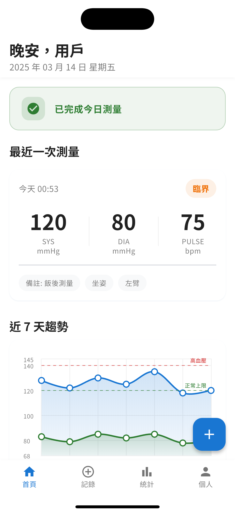

# 血壓追蹤 - 健康監測應用程式

<div align="center">
  
</div>

## 📱 應用程式概述

「血壓追蹤」是一款專為需要定期監測血壓的用戶設計的健康管理應用程式。透過簡潔直觀的界面，幫助用戶記錄、追蹤和分析血壓數據，提供健康建議，促進心血管健康管理。

<div align="center">
  
</div>

## ✨ 主要功能

### 📊 血壓記錄與追蹤

- 快速記錄收縮壓、舒張壓和脈搏數據
- 支援添加測量姿勢、使用手臂和個人備註
- 自動分類血壓狀態（正常、臨界、偏高）

### 📈 數據分析與視覺化

- 7 天趨勢圖表直觀展示血壓變化
- 詳細統計分析，包括平均值、最高/最低值
- 血壓狀態分佈比例

### 🔔 健康提醒與建議

- 每日測量提醒功能
- 根據血壓數據提供個性化健康建議
- 專業醫療知識小貼士

### 👤 個人檔案管理

- 用戶資料管理
- 個人健康目標設定
- 數據備份與恢復

## 🛠️ 技術特點

- **Flutter 框架**：跨平台支援，流暢的用戶體驗
- **現代化 UI/UX 設計**：符合 Material Design 3 設計規範
- **本地數據存儲**：保護用戶隱私，無需網絡連接
- **圖表視覺化**：使用先進的圖表庫展示數據趨勢
- **輕量級架構**：優化性能，減少資源佔用

## 📋 使用指南

### 記錄血壓

1. 點擊主頁面右下角的「+」按鈕
2. 輸入收縮壓、舒張壓和脈搏數據
3. 選擇測量姿勢和使用的手臂
4. 添加備註（如需要）
5. 點擊「保存」完成記錄

### 查看趨勢

- 主頁面自動顯示最近 7 天的血壓趨勢圖
- 點擊「查看詳情」進入統計頁面，獲取更詳細的分析

### 設置提醒

1. 進入「個人」頁面
2. 選擇「測量提醒」
3. 設置提醒時間和頻率

## 🔜 未來計劃

- 多用戶管理功能
- 數據導出為 PDF/CSV 格式
- 與醫療專業人士共享數據功能
- 與其他健康應用程式整合
- 智能血壓分析與預警

## 📝 開發者說明

本應用程式使用 Flutter 框架開發，採用 Provider 狀態管理，遵循 MVVM 架構設計模式。

### 環境要求

- Flutter 3.0.0 或更高版本
- Dart 2.17.0 或更高版本
- Android Studio / VS Code

### 安裝與運行

```bash
# 克隆專案
git clone https://github.com/yourusername/blood_pressure_app.git

# 進入專案目錄
cd blood_pressure_app

# 安裝依賴
flutter pub get

# 運行應用
flutter run
```

## 📄 授權協議

本專案採用 MIT 授權協議 - 詳情請參閱 [LICENSE](LICENSE) 文件。

## 🙏 致謝

- 感謝所有為本專案提供建議和反饋的用戶
- 特別感謝醫療專業人士對血壓分類標準的指導
- 圖標和設計元素來自 [Material Design](https://material.io/design)

---

<div align="center">
  <p>用心守護您的心臟健康</p>
  <p>© 2023 血壓追蹤應用程式團隊</p>
</div>
