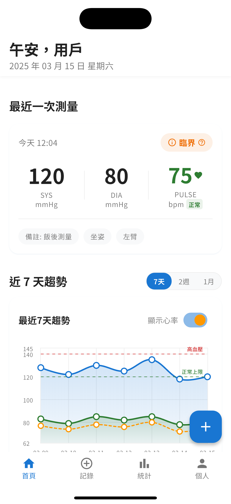
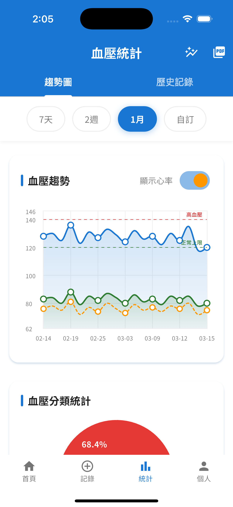
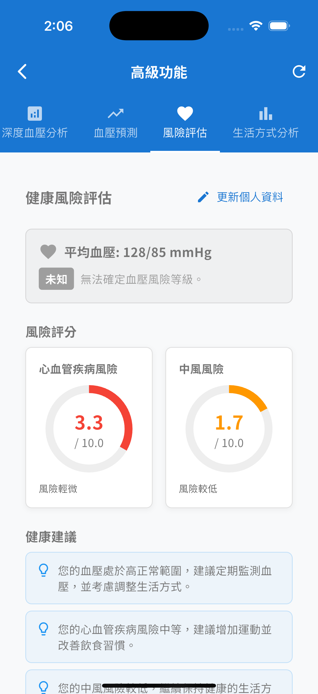

<div align="center">
  <h1><a href="#blood-pressure-manager---health-monitoring-application">English Version</a> | <a href="#血壓管家---健康監測應用程式">繁體中文版</a></h1>
</div>

# Blood Pressure Manager - Health Monitoring Application

<div align="center">
  
</div>

## 📱 Application Overview

"Blood Pressure Manager" is a health management application designed for users who need to regularly monitor their blood pressure. Through a clean and intuitive interface, it helps users record, track, and analyze blood pressure data, provides health recommendations, and promotes cardiovascular health management.

<div align="center">
  
  
  
</div>

## ✨ Key Features

### 📊 Blood Pressure Recording and Tracking

- Quick recording of systolic pressure, diastolic pressure, and pulse data
- Support for adding measurement posture, arm used, and personal notes
- Automatic classification of blood pressure status (normal, elevated, stage 1 hypertension, stage 2 hypertension)
- Color-coded indicators for different blood pressure levels

### 📈 Data Analysis and Visualization

- Multi-timeframe trend charts (7 days, 2 weeks, 1 month)
- Detailed statistical analysis, including averages, highest/lowest values
- Blood pressure status distribution ratios
- Advanced analysis features including morning surge analysis and measurement condition comparisons
- Beautiful data visualizations with professional medical color scheme

### 🔔 Health Reminders and Recommendations

- Daily measurement reminder function
- Personalized health recommendations based on blood pressure data
- Professional medical knowledge tips
- Risk assessment for cardiovascular diseases
- Smart notification system with adjustable frequency

### 👤 Personal Profile Management

- User profile management
- Personal health goal setting
- Data backup and recovery
- Multi-language support (Traditional Chinese, Simplified Chinese, English)
- Medication tracking and reminder

### 📋 Advanced Features

- Health report generation in PDF format
- Lifestyle correlation analysis
- Blood pressure trend prediction
- Onboarding experience for new users
- Medication effectiveness analysis

## 🛠️ Technical Features

- **Flutter Framework**: Cross-platform support, smooth user experience
- **MVVM Architecture**: Clear code structure, easy to maintain and extend
- **Local Data Storage**: Protects user privacy, no network connection required
- **Adaptive UI**: Adapts to different device sizes and screens
- **Material Design 3**: Modern design language, providing a consistent visual experience
- **Internationalization**: Full support for multiple languages
- **Theme Customization**: Light and dark mode support (coming soon)
- **Professional Medical Color Scheme**: Medical blue primary color with scientifically calibrated accent colors

## 📋 User Guide

### Recording Blood Pressure

1. Click the "+" button in the bottom right corner of the main page or "Record" in the bottom navigation bar
2. Enter systolic pressure, diastolic pressure, and pulse data
3. Select measurement posture and arm used
4. Add notes (if needed)
5. Click "Save" to complete the record

### Viewing Trends

- The main page automatically displays recent blood pressure trend charts
- Different time ranges can be selected (7 days, 2 weeks, 1 month)
- Click "View Details" to enter the statistics page for more detailed analysis
- Advanced analysis features are available in the Statistics section
- Use the comparison tool to analyze different time periods or conditions

### Health Recommendations

- The main page displays health recommendations based on the user's blood pressure condition
- Click on recommendation cards to get more related information
- Risk assessment provides personalized health advice
- Access a knowledge base of professional health articles

## 🔜 Future Plans

- Multi-user management functionality
- Data export in PDF/CSV formats
- Data sharing with healthcare professionals
- Direct connection to Bluetooth blood pressure monitors
- Intelligent blood pressure analysis and early warning
- Cloud synchronization for data backup
- Dark theme support with eye-comfort design

## 📝 Developer Notes

This application is developed using the Flutter framework and adopts the MVVM architectural design pattern.

### Environment Requirements

- Flutter 3.7.0 or higher
- Dart 3.0.0 or higher
- Android Studio / VS Code

### Installation and Running

```bash
# Clone the project
git clone https://github.com/yourusername/blood_pressure_app.git

# Enter the project directory
cd blood_pressure_app

# Install dependencies
flutter pub get

# Run the application
flutter run
```

## 📄 License

This project is licensed under the MIT License - see the [LICENSE](LICENSE) file for details.

## 🙏 Acknowledgements

- Thanks to all users who provided suggestions and feedback for this project
- Special thanks to healthcare professionals for guidance on blood pressure classification standards
- Icons and design elements from [Material Design](https://material.io/design)
- Medical data reference from international health organizations

<div align="center">
  <p>Caring for your heart health</p>
  <p>© 2024 Blood Pressure Manager Team</p>
</div>

---

<div align="center">
  <h1><a href="#blood-pressure-manager---health-monitoring-application">English Version</a> | <a href="#血壓管家---健康監測應用程式">繁體中文版</a></h1>
</div>

# 血壓管家 - 健康監測應用程式

<div align="center">
  
</div>

## 📱 應用程式概述

「血壓管家」是一款專為需要定期監測血壓的用戶設計的健康管理應用程式。透過簡潔直觀的界面，幫助用戶記錄、追蹤和分析血壓數據，提供健康建議，促進心血管健康管理。

<div align="center">
  
  
  
</div>

## ✨ 主要功能

### 📊 血壓記錄與追蹤

- 快速記錄收縮壓、舒張壓和脈搏數據
- 支援添加測量姿勢、使用手臂和個人備註
- 自動分類血壓狀態（正常、偏高、高血壓一級、高血壓二級）
- 不同血壓級別的顏色編碼指示器

### 📈 數據分析與視覺化

- 多時間範圍趨勢圖表（7 天、2 週、1 個月）
- 詳細統計分析，包括平均值、最高/最低值
- 血壓狀態分佈比例
- 進階分析功能，包括晨峰血壓分析和測量條件比較
- 專業醫療配色方案的精美數據視覺化

### 🔔 健康提醒與建議

- 每日測量提醒功能
- 根據血壓數據提供個性化健康建議
- 專業醫療知識小貼士
- 心血管疾病風險評估
- 可調頻率的智能通知系統

### 👤 個人檔案管理

- 用戶資料管理
- 個人健康目標設定
- 數據備份與恢復
- 多語言支援（繁體中文、簡體中文、英文）
- 用藥追蹤與提醒

### 📋 進階功能

- 健康報告生成（PDF 格式）
- 生活習慣關聯分析
- 血壓趨勢預測
- 新用戶引導體驗
- 藥物有效性分析

## 🛠️ 技術特點

- **Flutter 框架**：跨平台支援，流暢的用戶體驗
- **MVVM 架構**：清晰的代碼結構，便於維護和擴展
- **本地數據存儲**：保護用戶隱私，無需網絡連接
- **自適應 UI**：適配不同尺寸的設備和屏幕
- **Material Design 3**：現代化的設計語言，提供一致的視覺體驗
- **國際化**：完整支援多種語言
- **主題定制**：支援淺色和深色模式（即將推出）
- **專業醫療配色方案**：醫療藍主色調搭配科學校準的輔助色彩

## 📋 使用指南

### 記錄血壓

1. 點擊主頁面右下角的「+」按鈕或底部導航欄的「記錄」
2. 輸入收縮壓、舒張壓和脈搏數據
3. 選擇測量姿勢和使用的手臂
4. 添加備註（如需要）
5. 點擊「保存」完成記錄

### 查看趨勢

- 主頁面自動顯示最近血壓趨勢圖
- 可選擇不同時間範圍（7 天、2 週、1 個月）
- 點擊「查看詳情」進入統計頁面，獲取更詳細的分析
- 在統計部分可使用進階分析功能
- 使用比較工具分析不同時期或條件的數據

### 健康建議

- 主頁面顯示根據用戶血壓狀況提供的健康建議
- 點擊建議卡片獲取更多相關信息
- 風險評估提供個性化健康建議
- 訪問專業健康文章知識庫

## 🔜 未來計劃

- 多用戶管理功能
- 數據導出為 PDF/CSV 格式
- 與醫療專業人士共享數據功能
- 藍牙血壓計直接連接功能
- 智能血壓分析與預警
- 雲端同步數據備份
- 深色主題支援與護眼設計

## 📝 開發者說明

本應用程式使用 Flutter 框架開發，採用 MVVM 架構設計模式。

### 環境要求

- Flutter 3.7.0 或更高版本
- Dart 3.0.0 或更高版本
- Android Studio / VS Code

### 安裝與運行

```bash
# 克隆專案
git clone https://github.com/yourusername/blood_pressure_app.git

# 進入專案目錄
cd blood_pressure_app

# 安裝依賴
flutter pub get

# 運行應用
flutter run
```

## 📄 授權協議

本專案採用 MIT 授權協議 - 詳情請參閱 [LICENSE](LICENSE) 文件。

## 🙏 致謝

- 感謝所有為本專案提供建議和反饋的用戶
- 特別感謝醫療專業人士對血壓分類標準的指導
- 圖標和設計元素來自 [Material Design](https://material.io/design)
- 醫療數據參考來自國際健康組織

<div align="center">
  <p>用心守護您的心臟健康</p>
  <p>© 2024 血壓管家團隊</p>
</div>
